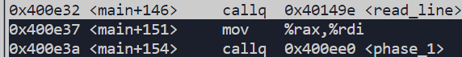

# Procedure of Solving Bomb lab

## Phase 1

First we set two breakpoints, one is at line 73, the other is the entry of the function `phase_1`

```c
73    input = read_line();             /* Get input                   */
74    phase_1(input);                  /* Run the phase               */
```


Second, create a new file answer.txt as input strings for bomb phases and pass it through the bomb exec-file. I use below strings as input:

```
1
22
333
4444
55555
666666
```

then `run answer.txt` and it hits the breakpoint 1:



From the assembly code we can see what happen here:

1. call read_line() func and store the return value in `%rax`
2. copy the `%rax` to `%rdi` to pass the parameter for function `phase_1`

Use `nexti` to finish the `read_line` func call.

We can inspect the value of `%rax` and it is exactly the first line of answer.txt:

```shell
(gdb) x/s $rax
0x603780 <input_strings>:       "1"
```

Then use `stepi` to enter the `phase_1`, below shows the entry code of it:


It pass something to `%esi` and we don't know what it is yet. But we can see then it calls `string_not_equal` func, let's step into it and see what happens:


From the function name we know that it's calling `string_length` to calculate the length of two strings and then compare these lengths. 

At the beginning, `%rdi` is our string "1" in answer.txt. Both `%rdi` and `%rsi`  are parameters passed to the func strings_not_equal. So here we can now that the addr of "password" is in `%rsi`, which is 0x402400. Use command below and we can get the password:

```shell
(gdb) x/s 0x402400
0x402400:       "Border relations with Canada have never been better."
```

It is easy to check the answer since the length of the sentence is same as the return value of second `string_length` func call, which is 52. Or you can check it by set another breakpoint after the phase_1 in `main` and you will see the "Phase 1 defused. How about the next one?" printed.


## Phase 2

It's easy to find a `sscanf` function, before which lies a `mov` instruction copying something from an address to register. Use `x/s` cmd to examine the addr and result shows "%d %d %d %d %d %d", so this is the 'format' parameter of `sscanf` and it needs six integers as input. After that there's a comparison that pick up the previous number, then double it and compare it with next number. The bomb would explode if not equals. Thus we have the answer:

```shell
1 2 4 8 16 32
```


## Phase 3

Similar to Phase 2, it's easy to know that it needs 2 integers as input.

For the first integer of our input, there's a unsigned less or equal comparison shown below that limits the range of first integer as [0, 7], otherwise the bomb explodes.

```assembly
compl $0x7, 0x8(%rsp)
ja 0x400fad
```

Meanwhile, the first integer will be used for indirect jump instruction `jmpq addr(, %rax, 8)`. The value of `%rax` is our first integer. It takes [add + 8 * %rax] as addr and pick the content of addr from memory, then jump to where the content indicates. We can use below cmd to examine the contents next to addr:

```shell
x/8gx addr
```

After examining, we know that it's doing some numeric comparisons. The program needs our second number same as the destination value. Below lies 8 optional input:

```shell
0 207
1 311
2 707
3 256
4 389
5 206
6 682
7 327
```


## Phase 4

Similar to Phase 2, it's easy to know that it needs 2 integers as input.

For the second number, it requires it to be zero. For the first number, its range lies in [0, 14] and will be passed to `int fun4(int val, int min, int max)` when min=0 and max=14, meanwhile the return value should be 0. Consequently, we need to figure out what does `fun4` do

Below lies the C code translate from assembly:

```c
int fun4(int val, int min, int max)
{
    /*
    int res = max;
    res -= min;	// res = max - min
    int tmp = res;
    tmp >>= 31;	// tmp = 0
    res += tmp;
    res >>= 1;	// res = (max - min) / 2
    tmp = res + min;	// tmp = (min + max) / 2, in case of overflow
    Original translated code lies above, the should be equivalent to below
    */
    int res;
    int mid = min + (max - min) / 2;
    
    if (mid > val)
    {
        max = mid - 1;
        res = 2 * fun4(val, min, max);
    }
    else
    {
        res = 0;
        if (mid < val)
        {
            min = mid + 1;
            res = 2 * fun4(edi, esi, edx) + 1;
        }
    }
    
    return res;
}
```

From the code we know that it's doing binary search recursively. For the purpose of making the return value as 0, the `mid < val` branch must not be executed, which means during recursion only `mid >= val` is permitted, iff at last recursion `mid == val`. Thus the first input must <= 7, and then we just exhaust all possibility in [0, 7] to get all solutions:

```shell
7 0
3 0
1 0
0 0
```


## Phase 5

Take a string whose length is 6 as input, then in loop do something on each char. After the loop compare the string with "flyers", equality means successfully defused. Core code translated as below:

```c
char* sentence = "maduiersnfotvbylSo you think you can stop the bomb with ctrl-c, do you?";		// strlen(sentence) = 71

void phase_5(char* input)
{
    if (strlen(input) != 6)
        explode_bomb();
    
    char[6] pickup;
    for (int i = 0; i < 6; i++)
    {
		char c = input[i];
        char j = c & 0xf;
        pickup[i] = sentence[(int)j];
    }
    if (strings_not_equal(pickup, "flyers"))
        explode_bomb();
}

int strings_not_equal(char* a, char* b);	// return 1 if equals, else return 0
```

From the code we know that it takes low 4 bits of input char as index (so the range is [0, 15]) to pick letter up from `sentence` to finally make up the "flyers". Below lie the optional inputs:

```shell
f: 9 	--> ) 9 Y i y
l: 15	--> / O o
y: 14	--> . > N ^ n ~
e: 5	--> % 5 E U e u
r: 6	--> & F V f v
s: 7	--> ' 7 G W g w
```


## Phase 6

Input requires 6 integers and each one range in [1, 6]. In a nested loop, it judges whether each number is unique (i.e. each one unequals to each other). After that for each number `input[i]` makes it to be `7-input[i]`, i.e. `newInput[i] = 7 - input[i]`.

Then at 0x6032d0 of memory lies a "Node" array. At the meanwhile these nodes in array compose a linked list.


Then there's a loop. In each loop from the beginning of `targetNode` linked list, step forward`newInput[i]-1` times to get a node. Assign the addr of node to `targetAddr[i]`. When loop completes, **assume** the `targetAddr` array represents [node3, node4, node5, node1, node 2, node 6]. In next loop it modifies the original "Node" linked list to be 3 -> 4 -> 5 -> 1 -> 2 -> 6. After the modification, we examine the value of each node in new linked list and requires it to be descending. Below lies the C code translation:

```c
struct Node
{
    int val;
    int index;
    struct Node* next;
}

Node targetNode[6] = {{0x14c, 1, 0x6032e0},	// node1
                      {0x0a8, 2, 0x6032f0},	// node2
                      {0x39c, 3, 0x603300},	// node3
                      {0x2b3, 4, 0x603310},	// node4
                      {0x1dd, 5, 0x603320},	// node5
                      {0x1bb, 6, 0x000000},	// node6
                     };	// &targetNode[0] == 0x6032d0

Node* targetAddr[6];
for (int i = 0; i < 6; i++)
{
    int val = newInput[i];
    Node* node = &targetNode;
    for (int j = 1; j < val; j++)
    {
        node = node->next;
    }
    targetAddr[i] = node;
}

for (int i = 0; i < 5; i++)
{
    targetAddr[i]->next = targetAddr[i + 1];
}
targetAddr[5]->next = 0;

for (int i = 5; i > 0; i--)
{
    rax = addr->next;
    if (addr->val < rax->val)	// descending rank
        explode_bomb();
    addr++;
}
```

From the analysis above, "step forward `newInput[i] - 1` times" de facto determines the sequence of new linked list. Finally we have the answer:

```c
newInput - 1 			--> 2 3 4 5 0 1
newInput 				--> 3 4 5 6 1 2
input = 7 - newInput 	--> 4 3 2 1 6 5    
```


Now all phases are passed and bomb is defused.
