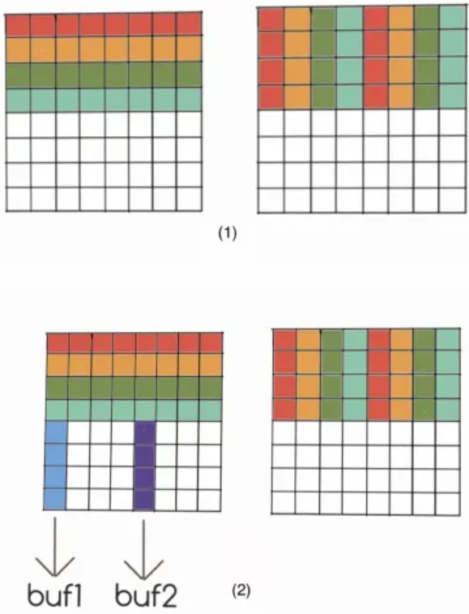
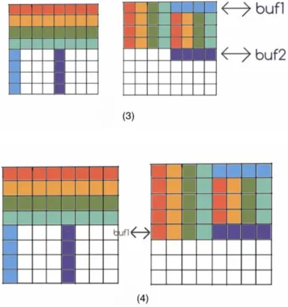

# Solving Cache Lab Step by Step

## Part A: Writing a Cache Simulator

Since the config of cache is not compile-constant, we shall use `malloc` to allocate our space to simulate the cache.

We use two struct `CacheSetStru` and `CacheLineStru` to simulate the set and the line.

```c
typedef struct cacheLine
{
	ull tag;
	struct cacheLine* prev;
	struct cacheLine* next;
	byte isValid;
} CacheLineStru;

typedef struct cacheSet
{
	CacheLineStru* cacheLines;
} CacheSetStru;
```

The pointer inside `CacheSetStru` leads to a double-linked list. The head of the list is least used and will be used for replacement while the tail is the most often used, such that the `CacheLineStru` should contain both `*prev` and `*next` pointers instead of just one.

For convenience, all `CacheSetStru` can be allocated altogether so that we can use it as an array, while the set id is the index for retrieval. Similarly, all `CacheLineStru` could do the same since allocating a big continuous memory space is much faster than allocating sparse small pieces.

Step of testing trace actions are as follow:

1. Get the set id and tag id from addr.
2. Retrieve the `CacheSetStru` array with set id to get one cache set.
3. Retrieve through the double-linked list owned by `CacheSetStru` to try to hit the cache line.
4. Both hit and miss will lead to update of the double-linked list. For hit, the line got hit will be moved to the tail of the list. For miss, it take the head of list, change head's content and move it to the tail.

During debugging, we can use redirection command like this to get an output txt file. Compare it with the ref output txt file using VSCode or others can help you quickly locate the wrong output. Then use gdb and VSCode to debug.

```shell
./csim -v -s 2 -E 2 -b 3 -t traces/trans.trace > csim_result.txt 
```


## Part B: Optimizing Matrix Tranpose

### I Blocking

Reference to [waside-blocking.pdf (cmu.edu)](http://csapp.cs.cmu.edu/public/waside/waside-blocking.pdf), we know that blocking is a good way to reduce cache miss.

The cache is 1KB direct-mapped and each block is 32 bytes (8 int). Number of Set is 32. The first tested matrix is 32 x 32. Fill it with cache blocks, we have 4 blocks per row and 8 rows to make cache full. So our submatrix’s max magnitude is 8. If greater than 8, at the 9th row it will cause capacity miss.

We use 8 as our submatrix magnitude. In theory, both source block and target should causes 8 cache misses. The matrix is 32 x 32 which means there are 16 blocks. 16 blocks * (8 + 8) miss = 256 misses. That's the theorical number.

Below lies code of this method:

```c
int bsize = 8;
int en = bsize * (M / bsize);
for (int i = 0; i < en; i += bsize)
{
    for (int j = 0; j < en; j += bsize)
    {
        for (int bi = i; bi < i + bsize; bi++)
        {
            for (int bj = j; bj < j + bsize; bj++)
            {
                B[bi][bj] = A[bj][bi];
            }
        }
    }
}
```

#### Result & Analysis

```shell
$ ./test-trans -M 32 -N 32

Function 0 (2 total)
Step 1: Validating and generating memory traces
Step 2: Evaluating performance (s=5, E=1, b=5)
func 0 (Transpose submission): hits:1710, misses:343, evictions:311

Function 1 (2 total)
Step 1: Validating and generating memory traces
Step 2: Evaluating performance (s=5, E=1, b=5)
func 1 (Simple row-wise scan transpose): hits:870, misses:1183, evictions:1151

Summary for official submission (func 0): correctness=1 misses=343

TEST_TRANS_RESULTS=1:343
```

Compared to 1183 misses of "Simple row-wise scan transpose", 343 misses of simple blocking is huge progress, but far from getting full scores (less than 300 misses). Now let's analyze what makes the difference between the theorical number and de factor number.

Print the addr of A and B:

```
A:55ed51a670a0, B:55ed51aa70a0
```

Block size = 32 = 2^5^ , so the lower 5 bits is for block offset. The Set index is at 5th ~ 10th bit, and they’re identical. In sub-matrix, a row in B needs a col in A. In cache it means 1 row in B and 8 rows for A. It causes conflict miss at intersection, which is the sub-matrix along the diagonal.

First of all, according to previous analysis, the regular miss of A and B is 16.

When copying at **diagonal** (`B[m][m] = A[m][m]`), A\[m\] is not in cache, its loading conflicts with `B[m]` (miss 1). when it is stored to `B[m]`, `B[m] `will be reloaded into cache again (miss 2). So there are 2 ***extra*** misses.

The situations at first row is special. For the first row, `A[m]` is loaded but then replaced by `B[m] `. However, both `A[m]` and `B[m] ` are first time loaded into cache. These 2 misses should have been counted in regular 16 misses, which means there is no extra miss.

Besides, at the end i-th row, the cache should contains `A[0..i-1, i+1...7] B[i]`. Both `B[i]` and `A[i+1]` will be replaced by `A[i]` and `B[i+1]` at the next row, but `B[i+1]` is its first time loaded. Consequently, except for first row, each row have 1 more ***extra*** misses.

extra misses = $2*7+7=21$, plus the regular 16 misses we have 37 misses per diagonal sub-matrix.

For 32x32 matrix, there are 4 diagonal submatrix. Total misses = $37*4+16*12=340$. Notice that there is a bias 3 between our analysis and test result. The bias 3 will exist in later analysis and maybe caused by function call.


### II Register Optimization

We are allowed to use 12 local variables of int type. We can simply copy one col of A into 8 registers, and copy value from registers to row of B.

Below lies the code:

```c
int a0, a1, a2, a3, a4, a5, a6, a7;
for (int i = 0; i < en; i += bsize)
{
    for (int j = 0; j < en; j += bsize)
    {
        for (int bi = i; bi < i + bsize; bi++)
        {
            a0 = A[j][bi];
            a1 = A[j+1][bi];
            a2 = A[j+2][bi];
            a3 = A[j+3][bi];
            a4 = A[j+4][bi];
            a5 = A[j+5][bi];
            a6 = A[j+6][bi];
            a7 = A[j+7][bi];
            B[bi][j] = a0;
            B[bi][j+1] = a1;
            B[bi][j+2] = a2;
            B[bi][j+3] = a3;
            B[bi][j+4] = a4;
            B[bi][j+5] = a5;
            B[bi][j+6] = a6;
            B[bi][j+7] = a7;
        }
    }
}
```

#### Result & Analysis

For diagonal submatrix, extra misses only happens at row i+1 when `B[i]` is replaced by `A[i+1]`. So there will be 7 misses per submatrix.

Total misses = $16*16+7*4=284$. And $284+bias=287$.

```shell
$ ./test-trans -M 32 -N 32

Function 0 (2 total)
Step 1: Validating and generating memory traces
Step 2: Evaluating performance (s=5, E=1, b=5)
func 0 (Transpose submission): hits:1766, misses:287, evictions:255

Function 1 (2 total)
Step 1: Validating and generating memory traces
Step 2: Evaluating performance (s=5, E=1, b=5)
func 1 (Simple row-wise scan transpose): hits:870, misses:1183, evictions:1151

Summary for official submission (func 0): correctness=1 misses=287

TEST_TRANS_RESULTS=1:287
```


### III Diagonal Copy First

Look back the analysis in *I Blocking*. At row i+1, `A[i+1]` will be replaced by `B[i+1]`. Then `B[i+1]` will be replaced again by `A[i+1]` due to diagonal element `A[i+1][i+1]`copying. In the end `B[i+1]` takes over again. Since we need `A[i+1]` at diagonal element, why not just copy it first for each row to avoid ping-pong conflicts?

Code:

```c
for (int i = 0; i < en; i += bsize)
{
    for (int j = 0; j < en; j += bsize)
    {
        for (int bi = i; bi < i + bsize; bi++)
        {
            for (int bj = j + bi - i; bj < j + bsize; bj++)
            {
                B[bi][bj] = A[bj][bi];
            }
            for (int bj = j + bi - i - 1; bj >= j; bj--)
            {
                B[bi][bj] = A[bj][bi];
            }
        }
    }
}
```

#### Result & Analysis

The extra miss happens at row i+1 when `B[i]` is replaced by `A[i]`. Consequently, each diagonal submatrix has 7 extra misses.

Total misses = $16*16+7*4=284$. And $284+bias=287$. Same as *II Register Optimization*

```shell
./test-trans -M 32 -N 32

Function 0 (2 total)
Step 1: Validating and generating memory traces
Step 2: Evaluating performance (s=5, E=1, b=5)
func 0 (Transpose submission): hits:1766, misses:287, evictions:255

Function 1 (2 total)
Step 1: Validating and generating memory traces
Step 2: Evaluating performance (s=5, E=1, b=5)
func 1 (Simple row-wise scan transpose): hits:870, misses:1183, evictions:1151

Summary for official submission (func 0): correctness=1 misses=287

TEST_TRANS_RESULTS=1:287
```


### IV Copy Then Transpose

Conflict misses happen at diagonal. Is it really unavoidable? The penultimate *Programming Rules for Part B* in assignment PDF says “Your transpose function may not modify array A. You may, however, **do whatever you want** with the contents of array B.” That’s an emphasis, isn’t it?

From previous analysis, the reason why diagonal submatrix causes conflicts is source and target matrix use different access order, one uses column order, the other uses row order. The crossover access order inevitably causes cache miss. So, how about use same order? Both access with row-order. From the previous emphasis and tip, we can copy A to B row by row then transpose in B itself. Of course we can’t just write `B[bi][bj] = A[bi][bj]`. Use method in *II Register Optimization* to eliminate conflict misses.

```c
int a0, a1, a2, a3, a4, a5, a6, a7;
for (int i = 0; i < en; i += bsize)
{
    for (int j = 0; j < en; j += bsize)
    {
        for (int bi = i, bj = j; bi < i + bsize; bi++, bj++)
        {
            a0 = A[bi][j];
            a1 = A[bi][j+1];
            a2 = A[bi][j+2];
            a3 = A[bi][j+3];
            a4 = A[bi][j+4];
            a5 = A[bi][j+5];
            a6 = A[bi][j+6];
            a7 = A[bi][j+7];
            B[bj][i] = a0;
            B[bj][i+1] = a1;
            B[bj][i+2] = a2;
            B[bj][i+3] = a3;
            B[bj][i+4] = a4;
            B[bj][i+5] = a5;
            B[bj][i+6] = a6;
            B[bj][i+7] = a7;
        }

        for (int k = 0; k < bsize; k++)
        {
            for (int s = k + 1; s < bsize; s++)
            {
                a0 = B[j + k][i + s];
                B[j + k][i + s] = B[j + s][i + k];
                B[j + s][i + k] = a0;
            }
        }
    }
}
```

#### Result & Analysis

No extra miss.

Total misses = $16*16+bias=259$

```shell
$ ./test-trans -M 32 -N 32

Function 0 (2 total)
Step 1: Validating and generating memory traces
Step 2: Evaluating performance (s=5, E=1, b=5)
func 0 (Transpose submission): hits:3586, misses:259, evictions:227

Function 1 (2 total)
Step 1: Validating and generating memory traces
Step 2: Evaluating performance (s=5, E=1, b=5)
func 1 (Simple row-wise scan transpose): hits:870, misses:1183, evictions:1151

Summary for official submission (func 0): correctness=1 misses=259

TEST_TRANS_RESULTS=1:259
```


### V 64x64 Matrix

More than 4 rows will cause capacity miss. However, 4 as submatrix’s magnitude will waste a lot of space.

Still use 8 as magnitude, but doing transpose with 4x4.

1. Load row 0~4 of A’s submatrix into cache. Top left and top right parts of B’s submatrix is the transpose of A’s 4x4 top left and top right parts.
2. Load row 5~7 of A’s submat. Store the col 0 and col 4 in local variables, named `buf 1` and `buf 2`.
3. The correct transpose should transpose A’s top right and bottom left to B’s bottom left and top right. Exchange `buf 1` with B’s top right’s row 1, meanwhile transpose the bottom right of B
4. Change pivot’s location and repeat step 2 to 4 until all elements set.



```c
int bsize = 8;
int a0, a1, a2, a3, a4, a5, a6, a7, tmp;
for (int i = 0; i < N; i += bsize)
{
    for (int j = 0; j < M; j += bsize)
    {
        for (int k = 0; k < bsize / 2; k++)
        {
            // A top left
            a0 = A[i + k][j];
            a1 = A[i + k][j + 1];
            a2 = A[i + k][j + 2];
            a3 = A[i + k][j + 3];
            // A top right
            a4 = A[i + k][j + 4];
            a5 = A[i + k][j + 5];
            a6 = A[i + k][j + 6];
            a7 = A[i + k][j + 7];

            // B top left
            B[j][i + k] = a0;
            B[j + 1][i + k] = a1;
            B[j + 2][i + k] = a2;
            B[j + 3][i + k] = a3;
            // B top right
            B[j][i + k + 4] = a4;
            B[j + 1][i + k + 4] = a5;
            B[j + 2][i + k + 4] = a6;
            B[j + 3][i + k + 4] = a7;
        }
        for (int k = 0; k < bsize / 2; k++)
        {
            // buf 1				// buf 2
            a0 = A[i + 4][j + k], 	a4 = A[i + 4][j + 4 + k];
            a1 = A[i + 5][j + k], 	a5 = A[i + 5][j + 4 + k];
            a2 = A[i + 6][j + k], 	a6 = A[i + 6][j + 4 + k];
            a3 = A[i + 7][j + k], 	a7 = A[i + 7][j + 4 + k];

            // B's top right transpose to bottom left (by exchanging)
            tmp = B[j + k][i + 4], B[j + k][i + 4] = a0, a0 = tmp;
            tmp = B[j + k][i + 5], B[j + k][i + 5] = a1, a1 = tmp;
            tmp = B[j + k][i + 6], B[j + k][i + 6] = a2, a2 = tmp;
            tmp = B[j + k][i + 7], B[j + k][i + 7] = a3, a3 = tmp;
            // write back to B's bottom left row and transpose B's bottom right
            B[j + k + 4][i + 0] = a0, B[j + k + 4][i + 4] = a4;
            B[j + k + 4][i + 1] = a1, B[j + k + 4][i + 5] = a5;
            B[j + k + 4][i + 2] = a2, B[j + k + 4][i + 6] = a6;
            B[j + k + 4][i + 3] = a3, B[j + k + 4][i + 7] = a7;
        }
    }
}
```

#### Result & Analysis

Transpose like this will eliminate the extra self-capacity miss in submatrix. For diagonal submats, step 1 causes 3 extra misses, step 2~4 will lead to 7 extra misses (`A[4..7]` into cache eliminate the `B[0..3]` but it will replace by for write, there exists 4 misses. Writing to `B[4..7]` will cause 3 extra misses for replacing and reloading row of A). For non-diagonal submats, its regular misses remain 8. 

Total misses = $8*2*64+(3+7)*8+bias=1107$

```shell
$ ./test-trans -M 64 -N 64

Function 0 (2 total)
Step 1: Validating and generating memory traces
Step 2: Evaluating performance (s=5, E=1, b=5)
func 0 (Transpose submission): hits:9138, misses:1107, evictions:1075

Function 1 (2 total)
Step 1: Validating and generating memory traces
Step 2: Evaluating performance (s=5, E=1, b=5)
func 1 (Simple row-wise scan transpose): hits:3474, misses:4723, evictions:4691

Summary for official submission (func 0): correctness=1 misses=1107

TEST_TRANS_RESULTS=1:1107
```

Furthermore, the misses in step 1 can be eliminated by *Copy Then Transpose* method, which reduces 24 misses.

Total misses = $1107-24=1083$

```c
for (int i = 0; i < N; i += bsize)
		{
			for (int j = 0; j < M; j += bsize)
			{
				for (int k = 0; k < bsize / 2; k++)
				{
					// A top left
					a0 = A[i + k][j];
					a1 = A[i + k][j + 1];
					a2 = A[i + k][j + 2];
					a3 = A[i + k][j + 3];
					// A top right
					a4 = A[i + k][j + 4];
					a5 = A[i + k][j + 5];
					a6 = A[i + k][j + 6];
					a7 = A[i + k][j + 7];

					// copy to B
					B[j + k][i] = a0;
					B[j + k][i + 1] = a1;
					B[j + k][i + 2] = a2;
					B[j + k][i + 3] = a3;
					B[j + k][i + 4] = a4;
					B[j + k][i + 5] = a5;
					B[j + k][i + 6] = a6;
					B[j + k][i + 7] = a7;
				}
				for (int k = 0; k < bsize / 2; k++)
				{
					for (int s = k + 1; s < bsize / 2; s++)
					{
						// top-left
						a0 = B[j + k][i + s];
						B[j + k][i + s] = B[j + s][i + k];
						B[j + s][i + k] = a0;
						// top-right
						a1 = B[j + k][i + s + 4];
						B[j + k][i + s + 4] = B[j + s][i + k + 4];
						B[j + s][i + k + 4] = a1;
					}
				}
				
                // ... same as before
			}
		}
```

Result:

```shell
$ ./test-trans -M 64 -N 64

Function 0 (2 total)
Step 1: Validating and generating memory traces
Step 2: Evaluating performance (s=5, E=1, b=5)
func 0 (Transpose submission): hits:12234, misses:1083, evictions:1051

Function 1 (2 total)
Step 1: Validating and generating memory traces
Step 2: Evaluating performance (s=5, E=1, b=5)
func 1 (Simple row-wise scan transpose): hits:3474, misses:4723, evictions:4691

Summary for official submission (func 0): correctness=1 misses=1083

TEST_TRANS_RESULTS=1:1083
```


### VI 61x67 Matrix

The requirements is less than 2,000 misses and it’s not hard to achieve.

Use 8x23 as submatrix. We have:

```c
#define min(a, b) (a > b ? b : a)

int a0, a1, a2, a3, a4, a5, a6, a7;
for (int i = 0; i < N; i += 8) 
{
    for (int j = 0; j < M; j += 23) 
    {
        if (i + 8 <= N && j + 23 <= M) 
        {
            for (int s = j; s < j + 23; s++) 
            {
                a0 = A[i][s];
                a1 = A[i + 1][s];
                a2 = A[i + 2][s];
                a3 = A[i + 3][s];
                a4 = A[i + 4][s];
                a5 = A[i + 5][s];
                a6 = A[i + 6][s];
                a7 = A[i + 7][s];
                B[s][i + 0] = a0;
                B[s][i + 1] = a1;
                B[s][i + 2] = a2;
                B[s][i + 3] = a3;
                B[s][i + 4] = a4;
                B[s][i + 5] = a5;
                B[s][i + 6] = a6;
                B[s][i + 7] = a7;
            }
        } 
        else 
        {
            for (int k = i; k < min(i + 8, N); k++) 
            {
                for (int s = j; s < min(j + 23, M); s++) 
                {
                    B[s][k] = A[k][s];
                }
            }
        }
    }
}
```

Result:

```shell
$ ./test-trans -M 61 -N 67

Function 0 (2 total)
Step 1: Validating and generating memory traces
Step 2: Evaluating performance (s=5, E=1, b=5)
func 0 (Transpose submission): hits:6316, misses:1863, evictions:1831

Function 1 (2 total)
Step 1: Validating and generating memory traces
Step 2: Evaluating performance (s=5, E=1, b=5)
func 1 (Simple row-wise scan transpose): hits:3756, misses:4423, evictions:4391

Summary for official submission (func 0): correctness=1 misses=1863

TEST_TRANS_RESULTS=1:1863
```


## Final Evaluation

The `driver.py` is originally written in python2, which is too old. modify it to support python3 (mostly just replace old `print` function without parentheses with new one with parentheses).

```shell
$ ./driver.py 
Part A: Testing cache simulator
Running ./test-csim
                        Your simulator     Reference simulator
Points (s,E,b)    Hits  Misses  Evicts    Hits  Misses  Evicts
     3 (1,1,1)       9       8       6       9       8       6  traces/yi2.trace
     3 (4,2,4)       4       5       2       4       5       2  traces/yi.trace
     3 (2,1,4)       2       3       1       2       3       1  traces/dave.trace
     3 (2,1,3)     167      71      67     167      71      67  traces/trans.trace
     3 (2,2,3)     201      37      29     201      37      29  traces/trans.trace
     3 (2,4,3)     212      26      10     212      26      10  traces/trans.trace
     3 (5,1,5)     231       7       0     231       7       0  traces/trans.trace
     6 (5,1,5)  265189   21775   21743  265189   21775   21743  traces/long.trace
    27


Part B: Testing transpose function
Running ./test-trans -M 32 -N 32
Running ./test-trans -M 64 -N 64
Running ./test-trans -M 61 -N 67

Cache Lab summary:
                        Points   Max pts      Misses
Csim correctness          27.0        27
Trans perf 32x32           8.0         8         259
Trans perf 64x64           8.0         8        1083
Trans perf 61x67          10.0        10        1863
          Total points    53.0        53
```


## Reference

1. [CSAPP Cache Lab 缓存实验 - 简书 (jianshu.com)](https://www.jianshu.com/p/e68dd8305e9c#fnref1)
